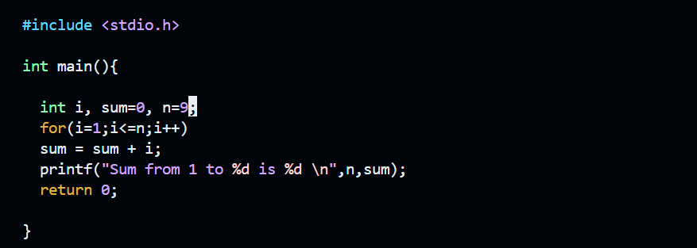
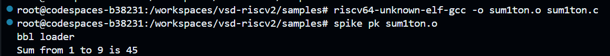
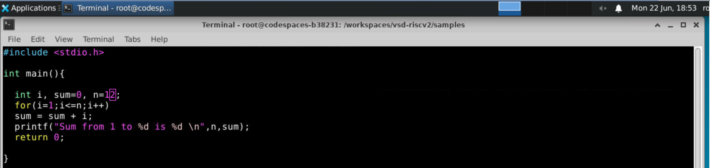
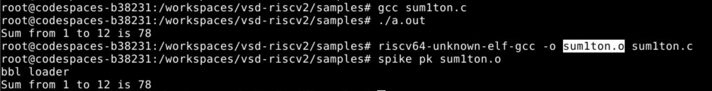
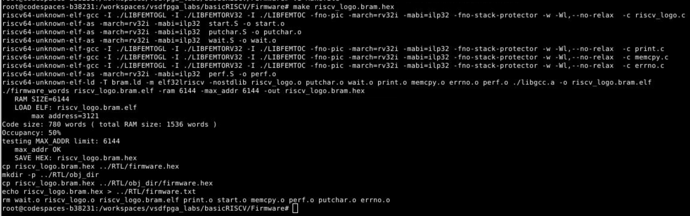
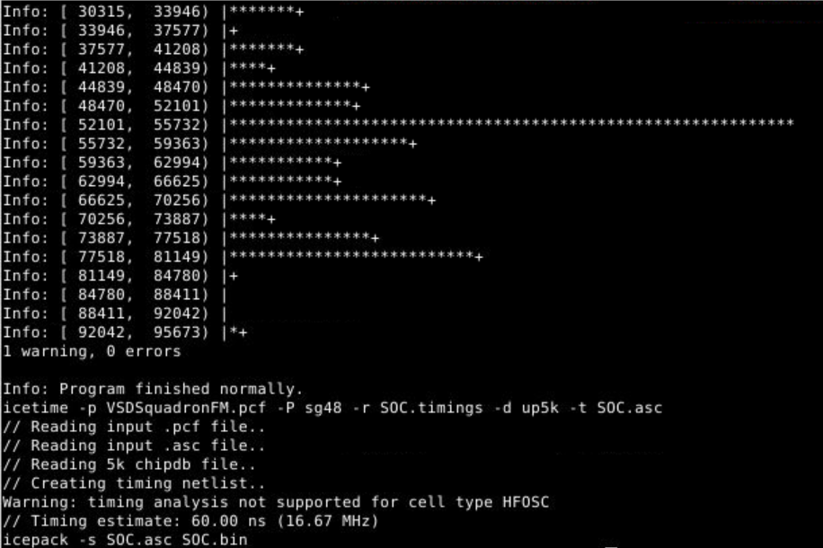
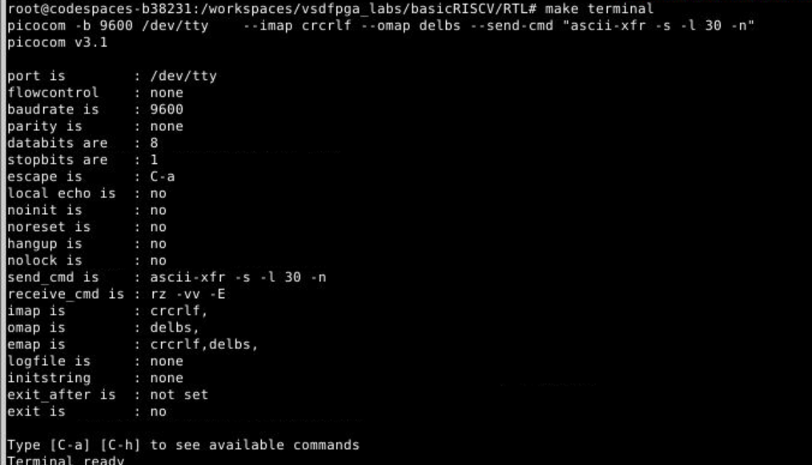

# RISC-V-FPGA-IP-Development

## Task 1

### RISC-V Reference Program

- RISCV Program \
  \
  
  
- Output \
  \
  
  
- Modified Program \
  \
  
  
- Output \
  \
  
  

### VSDFPGA Lab

- Firmware \
  \
  
  
- RTL \
  \
  

- Terminal
  \
  
  
### Understanding Check

- Where is the RISC-V program located in the vsd-riscv2 repository? \
  File location --> vsd-riscv2/samples/sum1ton.c
  
- How is the program compiled and loaded into memory? \
  The program sum1ton.c is compiled using riscv64-unknown-elf-gcc \
  The output sum1ton.o is loaded into memory by spike pk
  
- How does the RISC-V core access memory and memory-mapped IO? \
  The RISC-V core accesses memory using standard load/store instructions
  
- Where would a new FPGA IP block logically integrate in this system? \
  FPGA IP block will integrate as memory mapped peripheral on the system bus 

### Environment
- Codespace only
